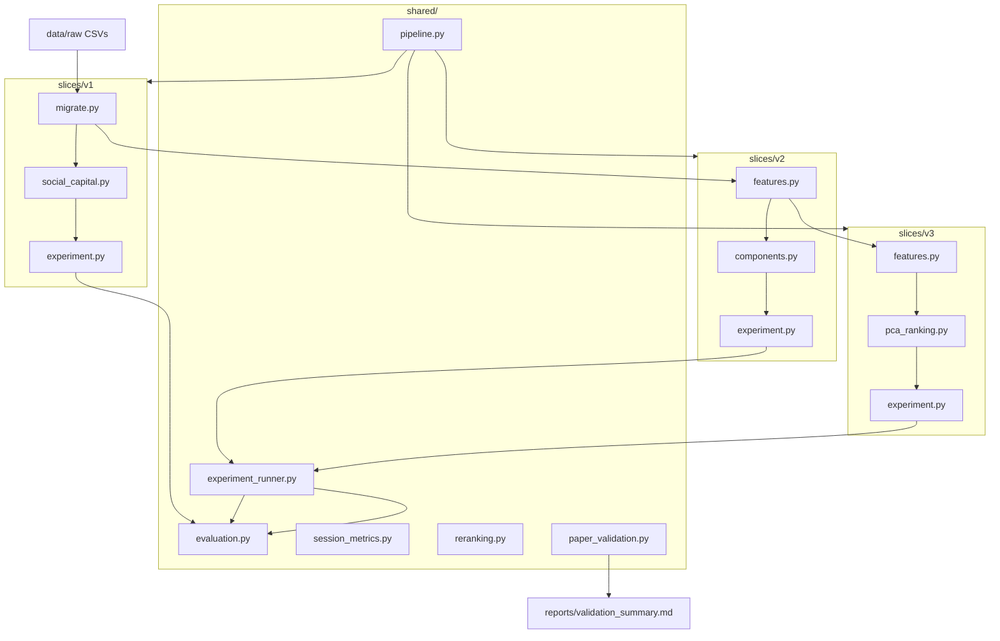

# Architecture

How the `recsocial_py` package is organized, how data flows through the pipeline, and where to find each concern in code.

## Design principles

1. **Vertical slices (V1 / V2 / V3)** — each paper version owns its domain logic; shared code handles evaluation, re-ranking, and reporting mechanics.
2. **CSV-only pipeline** — no database; all inputs and outputs are files under `data/` and `reports/`.
3. **Config-driven** — behavior is controlled by YAML in `configs/`; code reads configs via Pydantic models.
4. **Reproducible reports** — every experiment writes CSV metrics + markdown report + PNG figures.

## Repository layout

```text
social-capital/
├── docs/                    ← Guides and paper SDDs
└── recsocial_py/            ← Active Python package
    ├── configs/             ← v1.yaml, v2.yaml, v3.yaml, reference_results.yaml
    ├── data/raw/            ← Source CSVs (tracked in git)
    ├── data/v1|v2|v3/       ← Generated at runtime (gitignored)
    ├── reports/             ← Generated at runtime (gitignored)
    ├── src/recsocial/
    │   ├── cli.py
    │   ├── shared/
    │   └── slices/v1|v2|v3/
    └── tests/
```

## Data flow



## Shared modules (`src/recsocial/shared/`)

| Module | Responsibility |
|--------|----------------|
| `algorithms.py` | Canonical algorithm names and paper labels |
| `config_models.py` | `EvaluationConfig`, `PairedTestConfig`, `RerankConfig` |
| `config_loader.py` | YAML loading and path resolution |
| `evaluation.py` | Low-level MRR, MAP, NDCG, Precision@K |
| `session_metrics.py` | Per-user session evaluation with protocol switching |
| `paper_metrics.py` | Legacy notebook rank-column metrics |
| `reranking.py` | Score-based re-ranking of trial items |
| `experiment_runner.py` | Standard evaluate → persist → report flow (V2/V3) |
| `pipeline.py` | `run_v1_pipeline`, `run_v2_pipeline`, `run_v3_pipeline`, `run_all_pipelines` |
| `paper_validation.py` | Cross-paper validation (V1 + V2 + V3) |
| `reference_validation.py` | V2 AMCIS figure-level validation |
| `statistics.py` | Paired t-tests |
| `reporting.py` | Markdown table formatters |
| `visualization/` | Publication-style chart generation |

## Slice modules

### V1 (`slices/v1/`)

| Module | Role |
|--------|------|
| `migrate.py` | Raw CSVs → SDD schema (users, news, ratings, comments) |
| `social_capital.py` | Influence, popularity, reputation scoring |
| `sentiment.py` | VADER sentiment integration |
| `text_features.py`, `user_profile.py` | TF-IDF profiles for CS-PLUS |
| `recommenders.py` | Trial replay and ranking |
| `experiment.py` | Full V1 experiment + oracle validation |
| `reporting.py`, `figures.py` | Report and charts |

### V2 (`slices/v2/`)

| Module | Role |
|--------|------|
| `features.py` | Enrich news; compute component scores |
| `components.py` | Six weighted Social Capital components |
| `recommenders.py` | STATE_ART / SCSA_PLUS / SCSA_PLUS_V3 re-ranking |
| `experiment.py` | V2 experiment via `experiment_runner` |
| `reporting.py`, `figures.py` | Report + AMCIS validation tables |

### V3 (`slices/v3/`)

| Module | Role |
|--------|------|
| `tweet_metrics.py` | SCSA-PLUS per-tweet scoring |
| `user_metrics.py` | Author strength (reputation × influence) |
| `pca_ranking.py` | PCA feature matrix and first-component score |
| `features.py` | Orchestrates V2 enrich + V3 feature build |
| `recommenders.py` | SCSA-PLUS and PCA variant rankings |
| `statistics.py` | Correlation matrix and ranking shift analysis |
| `experiment.py` | V3 experiment + exploratory stats |
| `reporting.py`, `figures.py` | Report and charts |

## Config inheritance

```text
v1.yaml          ← standalone (paths, paper_targets, evaluation)
    ↑
v2.yaml          ← loads v1 via v1_config_path; adds components, reference validation
    ↑
v3.yaml          ← loads v2 + v1 paths; adds SCSA-PLUS, PCA, paper_targets
```

Each config resolves relative paths against the `recsocial_py/` package root.

## CLI command map

| Command | Calls |
|---------|-------|
| `recsocial run all` | `shared/pipeline.run_all_pipelines` + validate |
| `recsocial run v1` | `run_v1_pipeline` |
| `recsocial validate` | `shared/paper_validation.validate_all_papers` |
| `recsocial v1 experiment` | `slices/v1/experiment.run_experiment` |
| `recsocial v2 experiment` | `slices/v2/experiment.run_v2_experiment` |
| `recsocial v3 experiment` | `slices/v3/experiment.run_v3_experiment` |

## Experiment output artifacts

| Slice | Key CSVs | Report |
|-------|----------|--------|
| V1 | `trial_metrics_summary.csv`, `oracle_validation.csv` | `reports/v1/report.md` |
| V2 | `v2_metrics_summary.csv`, `tables/*_validation.csv` | `reports/v2/report.md` |
| V3 | `v3_metrics_summary.csv`, `correlation_matrix.csv` | `reports/v3/report.md` |

## Tests

| Directory | Covers |
|-----------|--------|
| `tests/v1/` | Social capital scoring, influence, metrics |
| `tests/v2/` | Component scoring, AMCIS reference validation |
| `tests/v3/` | SCSA-PLUS features, PCA |
| `tests/shared/` | Evaluation, visualization, cross-paper validation |
| `tests/fixtures/` | Minimal CSV fixtures for unit tests |

Run: `pytest tests/ -v`
