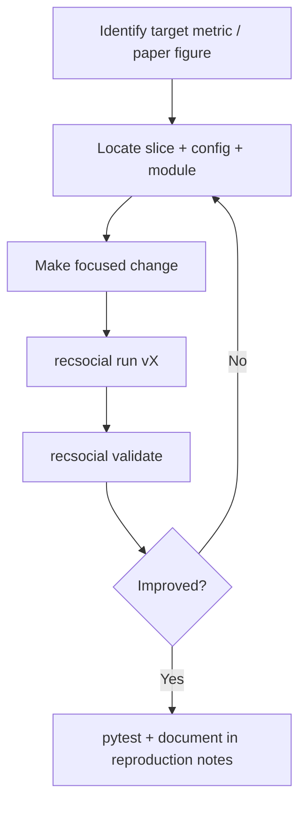

# Improving the algorithms

How to tune, extend, or experiment with the Social Capital recommender while keeping results reproducible and validated.

## Before you change anything

New to the data layer or running experiments from scratch? Start with the [Tutorial: data & algorithms](TUTORIAL.md).

1. Run a baseline: `recsocial run all`
2. Save validation output: `recsocial validate`
3. Run tests: `pytest tests/ -q`

After changes, repeat the same three steps and compare `reports/validation_summary.md`.

## Where to change what

| Goal | File(s) to edit |
|------|-----------------|
| V1 Social Capital weights / influence | `configs/v1.yaml`, `slices/v1/social_capital.py` |
| V1 sentiment behavior | `configs/v1.yaml` → `sentiment`, `slices/v1/sentiment.py` |
| V2 component weights | `configs/v2.yaml` → `social_capital.weights` |
| V2 component formulas | `slices/v2/components.py` |
| V2 STATE_ART re-ranking | `configs/v2.yaml` → `state_art`, `slices/v2/recommenders.py` |
| V3 SCSA-PLUS formula | `slices/v3/tweet_metrics.py`, `configs/v3.yaml` |
| V3 PCA settings | `configs/v3.yaml` → `pca`, `slices/v3/pca_ranking.py` |
| Evaluation protocol | `configs/v*.yaml` → `evaluation` |
| Paper targets / tolerance | `configs/v1.yaml`, `v3.yaml`, `reference_results.yaml` |
| Add paired t-test comparison | `configs/v2.yaml` or `v3.yaml` → `statistics.comparisons` |

## Example: tune V2 component weights

Edit `recsocial_py/configs/v2.yaml`:

```yaml
social_capital:
  weights:
    sentiment_impact: 0.25    # was 0.20
    engagement_score: 0.20
    content_relevance: 0.20
    network_influence: 0.15   # was 0.20
    author_influence: 0.10
    content_virality: 0.10
```

Re-run and validate:

```bash
recsocial run v2
recsocial validate
```

Check `reports/v2/report.md` and `reports/v2/tables/ranking_validation.csv` for impact on AMCIS figure metrics.

## Example: add a new re-ranking variant (V2/V3)

1. Add suffix to config:

```yaml
rerank_suffixes:
  state_art: STATE_ART
  scsa_plus: SCSA_PLUS
  scsa_plus_v3: SCSA_PLUS_V3
  my_variant: MY_VARIANT   # new
```

2. Implement scoring in `slices/v2/recommenders.py` (or V3 equivalent):

```python
# Inside build_reranked_recommendations — follow existing STATE_ART / SCSA_PLUS pattern
```

3. Add to statistics comparisons if you want t-tests:

```yaml
statistics:
  comparisons:
    - [B1-SCSA_PLUS, B1-MY_VARIANT]
```

4. Run experiment and add tests if the logic is non-trivial.

## Example: change relevance threshold

All versions use threshold 4 by default (rating ≥ 4 = relevant):

```yaml
evaluation:
  relevance_threshold: 4
```

Changing this affects all metrics. Update paper targets or tolerances if comparing to published values.

## Adding a new base algorithm

Base algorithms are defined in configs:

```yaml
base_algorithms:
  - B1
  - CS
  - SC
  - SCSA
```

To add e.g. `HYBRID`:

1. Add to `base_algorithms` in v2.yaml / v3.yaml
2. Implement scoring in the slice's `recommenders.py`
3. Ensure trial data exists in `ratings.csv` for the new algorithm
4. Update `shared/algorithms.py` if paper labels are needed
5. Add paper targets if validating against a publication

## Testing your changes

| Test type | Command |
|-----------|---------|
| Unit tests | `pytest tests/v1/` / `v2/` / `v3/` |
| Paper validation | `pytest tests/shared/test_paper_validation.py` |
| V2 figure validation | `pytest tests/v2/test_v2_reference_validation.py` |
| Full suite | `pytest tests/ -v` |

Add unit tests when you change scoring logic in:

- `slices/v1/social_capital.py`
- `slices/v2/components.py`
- `slices/v3/tweet_metrics.py`

## Code conventions

1. **Slice isolation** — V2 code must not import from V3; shared code must not import from slices.
2. **Config first** — expose tunable numbers in YAML, not hardcoded in Python.
3. **Algorithm names** — use `shared/algorithms.py` for labels; variant names follow `{BASE}-{SUFFIX}`.
4. **Reports** — every experiment path must write CSV + markdown via existing reporting helpers.
5. **Minimal diffs** — change only what your experiment requires; run tests after each logical change.

## Debugging metric changes

1. Compare `*_metrics_detail.csv` (per-user) vs `*_metrics_summary.csv` (aggregated)
2. For V2, inspect `v2_recommendations.csv` — check ranking order and ratings per algorithm
3. Read [Evaluation](EVALUATION.md) if a metric shifts unexpectedly — protocol differences explain many apparent gaps

## Suggested improvement workflow



## Documenting your changes

Update the relevant reproduction notes when you make intentional deviations from the paper:

- V1: `docs/v1/reproduction_notes.md`
- V2: `docs/v2/reproduction_notes_v2.md`
- V3: `docs/v3/reproduction_notes_v3.md`

Include: what changed, why, and the new validation numbers.

## Getting help from the codebase

| Question | Look at |
|----------|---------|
| How does V1 score a tweet? | `slices/v1/social_capital.py` |
| How does V2 re-rank trials? | `slices/v2/recommenders.py`, `shared/reranking.py` |
| How does V3 PCA work? | `slices/v3/pca_ranking.py` |
| How are metrics aggregated? | `shared/session_metrics.py` |
| How does the full pipeline run? | `shared/pipeline.py`, `cli.py` |

See also [Architecture](ARCHITECTURE.md) and [Version comparison](VERSION_COMPARISON.md).
