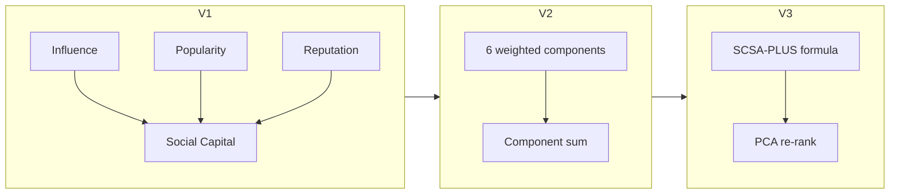

# Versions: V1, V2, and V3

Three implementations reproduce three published papers. Each builds on the previous version with the same dataset and base algorithms (`B1`, `CS`, `SC`, `SCSA`).

Validation criteria: [Evaluation](EVALUATION.md). Usage: [Guide](GUIDE.md).

## Papers and SDDs

| Version | Paper | SDD |
|---------|-------|-----|
| **V1** | [FedCSIS 2022](papers/Exploiting%20Social%20Capital%20for%20Recommendation%20in%20Social%20Networks.pdf) | [SDD](papers/SDD%20-%20Exploiting%20Social%20Capital%20for%20Recommendation%20in%20Social%20Networks.md) |
| **V2** | [AMCIS 2024](papers/Unlocking%20the%20Power%20of%20Social%20Capital%20Advanced%20Strategies%20for%20Enhanced%20Personalized%20Recommendations%20in%20Online%20Social%20Networks.pdf) | [SDD](papers/Unlocking%20the%20Power%20of%20Social%20Capital%20Advanced%20Strategies%20for%20Enhanced%20Personalized%20Recommendations%20in%20Online%20Social%20Networks.md) |
| **V3** | [SCSA-PLUS + PCA](papers/Exploiting%20Social%20Capital%20for%20Improving%20Personalized%20Recommendations%20in%20Online%20Social%20Networks.pdf) | [SDD](papers/Exploiting%20Social%20Capital%20for%20Improving%20Personalized%20Recommendations%20in%20Online%20Social%20Networks.md) |

## At a glance

| | **V1** | **V2** | **V3** |
|---|--------|--------|--------|
| **Focus** | Social Capital baseline | Multi-component SC | SCSA-PLUS + PCA |
| **Config** | `configs/v1.yaml` | `configs/v2.yaml` | `configs/v3.yaml` |
| **Code** | `slices/v1/` | `slices/v2/` | `slices/v3/` |
| **Validation** | `paper_targets` (12 checks) | `reference_results.yaml` (96 checks) | `paper_targets` (7 checks) |

## Scoring evolution



### V1 — Social Capital baseline

| Code | Paper label | Scoring |
|------|-------------|---------|
| `B1` | B1 | Engagement counts |
| `CS` | CS-PLUS | TF-IDF cosine similarity |
| `SC` | SC | Influence + popularity + reputation |
| `SCSA` | SC+SA | SC + VADER sentiment |

Modules: `social_capital.py`, `recommenders.py`, `experiment.py`

### V2 — Enhanced components

Per base algorithm `BASE`:

| Variant | Description |
|---------|-------------|
| `{BASE}-STATE_ART` | Original trial order |
| `{BASE}-SCSA_PLUS` | Re-rank by V1 SC+SA score |
| `{BASE}-SCSA_PLUS_V3` | Re-rank by V2 weighted component score |

Default weights (0.20 each): sentiment, engagement, content relevance, network influence; 0.10 author influence and virality.

Modules: `components.py`, `features.py`, `recommenders.py`

> In V2, suffix `SCSA_PLUS_V3` means V2 component re-ranking. In V3, the same suffix means PCA re-ranking.

### V3 — SCSA-PLUS + PCA

```text
(author_strength + interactions + media + diversity + mentions + token_length + context) × recency
```

| Variant | Description |
|---------|-------------|
| `{BASE}-STATE_ART` | Original trial order |
| `{BASE}-SCSA_PLUS` | Re-rank by `scsa_plus_score` |
| `{BASE}-SCSA_PLUS_V3` | PCA first-component re-rank |
| `SCSA_PLUS` | Standalone per-user ranking |

Modules: `tweet_metrics.py`, `pca_ranking.py`, `recommenders.py`

## Pipeline

```text
data/raw/ → V1 preprocess → V2 preprocess → V3 preprocess
         → V1 experiment  → V2 experiment  → V3 experiment
         → reports/v1/    → reports/v2/    → reports/v3/
```

`recsocial run all` executes the full chain with shared preprocessing.

## Which version to use

| Goal | Version |
|------|---------|
| Social Capital fundamentals | V1 |
| AMCIS enhanced-component paper | V2 |
| SCSA-PLUS + PCA paper | V3 |
| Compare all publications | `recsocial run all` + `recsocial validate` |
| Tune scoring | V2 or V3 configs — [Guide § Tune and extend](GUIDE.md#tune-and-extend) |

---

## V1 implementation notes

Per SDD §23. Assumptions used in the V1 implementation.

### Dataset and preprocessing

- **Schema:** Derived from `data/raw/tweets.csv` and `data/raw/ratings.csv`.
- **Text:** English pipeline per SDD §9 (`lowercase`, `remove_urls`, `remove_stopwords`, `ngram_range: [1,2]`).
- **User profile:** `rating_weight = rating - 3`; weighted average of rated news TF-IDF+numeric vectors.

### Algorithms

- **B1:** `likes_count + retweets_count + comments_count` (SDD §15.5).
- **CS-PLUS:** Hybrid TF-IDF + interaction counts + author metrics; cosine similarity; cold-start → SC-only (SDD §14.3).
- **Sentiment:** VADER with SDD weights (positive=1.5, negative=1.0, neutral=0.5, mixed=0.5).
- **Influence:** Default `paper_pseudocode` mode (zero followers → max_followers, zero lists → β=1, verified → +θ=1).

### Metrics and experiment

- **MAP:** SDD §17.3 — AP at each relevant position; MAP = mean AP per user-algorithm group.
- **Oracle scores:** `tweets.csv` oracle used for correlation validation; Python implements paper Algorithms 1–3.
- **Sessions:** Each user-algorithm group = one evaluation session (10 items).

### Algorithm naming

| Paper | Raw ratings code | Canonical |
|-------|------------------|-----------|
| SC | SC | SC |
| SC+SA | SCSA | SC+SA |
| CS-PLUS | CS | CS-PLUS |
| B1 | B1 | B1 |

---

## V2 implementation notes

Assumptions for AMCIS 2024 (Unlocking the Power of Social Capital).

- **STATE_ART:** `content_relevance + engagement_score` (SDD §12.3). Paper cites Tiwari et al. (2021); code not published.
- **SCSA_PLUS:** V1 SC+SA score as re-ranker.
- **SCSA_PLUS_V3:** Weighted component formula (SI, ES, CR, NI, AI, CV) from SDD §10.
- **Re-ranking:** For each base algorithm and user session — STATE_ART preserves trial order; SCSA_PLUS and SCSA_PLUS_V3 re-rank the same 10 items.
- **Scaling:** Default `minmax_0_1` in `configs/v2.yaml`. Alternative: `scaling_mode: standard`.
- **Extended formula:** Recency, diversity, context weights default to 0 (`use_extended_formula: true` to enable).
- **Reproduction:** Default `paper_aligned` mode merges computed and author rankings — see [Evaluation § Reproduction modes](EVALUATION.md#reproduction-modes-v2).

---

## V3 implementation notes

Assumptions for SCSA-PLUS + PCA.

### SCSA-PLUS formula (SDD §18)

- **author_strength:** reputation × influence
- **reputation:** listed-count fallback when mention/reply texts unavailable
- **influence:** log(followers+1) × (engagement_rate + 1), optional impressions
- **recency:** logarithmic decay
- **context:** TF-IDF cosine vs topic keywords when oracle ContextScore is zero
- **diversity:** oracle DiversityScore from `tweets.csv`

### PCA re-ranking

1. Hybrid matrix: numeric metrics + TF-IDF (tokens, hashtags, text)
2. `StandardScaler` → `PCA(95% variance)`
3. `pca1_score` = first principal component
4. Append `-SCSA_PLUS_V3` suffix and re-rank by `pca1_score`

### Evaluation

- Relevance threshold: rating ≥ 4
- Metrics: MRR, MAP@10, NDCG@10, Precision@1–5
- Paired t-tests: B1 vs SCSA_PLUS, SCSA vs SCSA_PLUS, STATE_ART vs *-SCSA_PLUS
