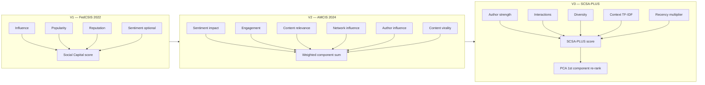

# Version comparison: V1, V2, and V3

Three incremental implementations reproduce three published papers. Each version **builds on the previous one** — they share the same dataset and base algorithms (`B1`, `CS`, `SC`, `SCSA`) but differ in how tweets are scored, how trial rankings are re-ordered, and how results are evaluated.

## At a glance

| | **V1** | **V2** | **V3** |
|---|--------|--------|--------|
| **Paper** | FedCSIS 2022 | AMCIS 2024 | SCSA-PLUS + PCA |
| **Focus** | Social Capital baseline | Multi-component enhanced SC | SCSA-PLUS formula + PCA re-ranking |
| **Config** | `configs/v1.yaml` | `configs/v2.yaml` | `configs/v3.yaml` |
| **Code** | `slices/v1/` | `slices/v2/` | `slices/v3/` |
| **Report** | `reports/v1/` | `reports/v2/` | `reports/v3/` |
| **Validation** | `paper_targets` in v1.yaml | `reference_results.yaml` (Figs 3–10) | `paper_targets` in v3.yaml |
| **Tolerance** | ±0.05 | ±0.03 strict / ±0.05 relaxed | ±0.02 |

## Evolution of the scoring model



### V1 — Social Capital baseline

**Question answered:** Does a Social Capital score (influence + popularity + reputation) improve recommendations over simpler baselines?

| Algorithm | Paper label | Scoring idea |
|-----------|-------------|--------------|
| `B1` | B1 | Engagement counts (likes, retweets, replies) |
| `CS` | CS-PLUS | Cosine similarity (user profile vs tweet TF-IDF) |
| `SC` | SC | Social Capital without sentiment |
| `SCSA` | SC+SA | Social Capital + VADER sentiment |

**Key modules:** `slices/v1/social_capital.py`, `recommenders.py`, `experiment.py`

**Experiment design:** Replays stored user trials from `ratings.csv`; evaluates trial order and re-ranking variants; includes oracle score correlation validation.

---

### V2 — Enhanced multi-component Social Capital

**Question answered:** Can decomposing Social Capital into weighted components (sentiment, engagement, relevance, network, author, virality) improve re-ranking over state-of-the-art trial order?

| Variant suffix | Meaning |
|----------------|---------|
| `{BASE}-STATE_ART` | Preserve original trial order (content + engagement baseline) |
| `{BASE}-SCSA_PLUS` | Re-rank trial items by V1 SC+SA score |
| `{BASE}-SCSA_PLUS_V3` | Re-rank by **V2 weighted component score** (not V3 PCA — see naming note below) |

**Key modules:** `slices/v2/components.py`, `features.py`, `recommenders.py`

**Component weights** (default, configurable in `v2.yaml`):

| Component | Weight |
|-----------|--------|
| Sentiment impact | 0.20 |
| Engagement score | 0.20 |
| Content relevance | 0.20 |
| Network influence | 0.20 |
| Author influence | 0.10 |
| Content virality | 0.10 |

**Validation:** 96 figure-level checks from AMCIS Figures 3–10 (`configs/reference_results.yaml`).

> **Naming note:** The suffix `SCSA_PLUS_V3` in V2 means “re-rank using the V2 enhanced component formula.” In V3, the same suffix name refers to **PCA-based re-ranking**. Always check which slice you are in — see [Architecture](ARCHITECTURE.md).

---

### V3 — SCSA-PLUS + PCA

**Question answered:** Does the full SCSA-PLUS composite (author strength, interactions, diversity, context, recency) with PCA re-ranking outperform V2 variants?

**SCSA-PLUS formula** (per tweet):

```text
(author_strength + interactions + media + diversity + mentions_strength + token_length + context) × recency
```

| Variant | Description |
|---------|-------------|
| `{BASE}-STATE_ART` | Original trial order |
| `{BASE}-SCSA_PLUS` | Re-rank by `scsa_plus_score` |
| `{BASE}-SCSA_PLUS_V3` | PCA first-component re-rank of the above |
| `SCSA_PLUS` | Standalone SCSA-PLUS ranking (used in paired t-tests) |

**Key modules:** `slices/v3/tweet_metrics.py`, `user_metrics.py`, `pca_ranking.py`, `recommenders.py`

**Extra analysis:** correlation matrix of features, ranking shift analysis, paired t-tests vs B1/SCSA.

## Base algorithms (shared across all versions)

| Code | Paper name | Role |
|------|------------|------|
| `B1` | B1 | Popularity / engagement baseline |
| `CS` | CS-PLUS | Content similarity baseline |
| `SC` | SC | Social Capital (interaction-oriented) |
| `SCSA` | SC+SA | Social Capital + sentiment |

Canonical naming helpers: `recsocial.shared.algorithms`

## Pipeline dependency

```text
data/raw/
    │
    ▼
V1 preprocess ──► data/v1/processed/  (users, news, ratings, comments)
    │
    ├──► V1 score + experiment ──► reports/v1/
    │
    ▼
V2 preprocess ──► data/v2/processed/  (enriched news)
    │
    ├──► V2 score + experiment ──► reports/v2/
    │
    ▼
V3 preprocess ──► data/v3/processed/  (user strength)
    │
    └──► V3 score + experiment ──► reports/v3/
```

Running `recsocial run all` executes this chain once, sharing preprocessing steps.

## Evaluation differences

Each paper was evaluated with slightly different metric conventions. The implementation preserves paper fidelity rather than forcing one protocol:

| Setting | V1 | V2 | V3 |
|---------|----|----|-----|
| `metric_protocol` | `session_list` | `session_list` | `paper_notebook` |
| `map_protocol` | `fedcsis_pooled` | `sdd` | `sdd` (default) |
| `graded_ndcg` | true | false | true |

See [Evaluation](EVALUATION.md) for full details.

## Current validation status

Run `recsocial validate` for live results. Typical outcomes:

| Version | Status | Notes |
|---------|--------|-------|
| V1 | **Pass** | All 12 FedCSIS targets within ±0.05 |
| V2 | **Partial** | Trends and many metrics match; some B1 MRR/MAP gaps remain |
| V3 | **Partial** | SCSA-PLUS headline (SC) matches; B1 MAP may differ slightly |

## Which version should I use?

| Goal | Start with |
|------|------------|
| Understand Social Capital fundamentals | **V1** |
| Reproduce AMCIS enhanced-component paper | **V2** |
| Reproduce SCSA-PLUS + PCA paper | **V3** |
| Compare all three against publications | `recsocial run all` + `recsocial validate` |
| Improve scoring / add components | **V2** or **V3** configs — see [Improving algorithms](IMPROVING.md) |

## Further reading

- [Tutorial: data & algorithms](TUTORIAL.md) — run all versions and use V3 CSV data with custom algorithms
- [Architecture](ARCHITECTURE.md) — module-level map
- [V1 reproduction notes](v1/reproduction_notes.md)
- [V2 reproduction notes](v2/reproduction_notes_v2.md)
- [V3 reproduction notes](v3/reproduction_notes_v3.md)
