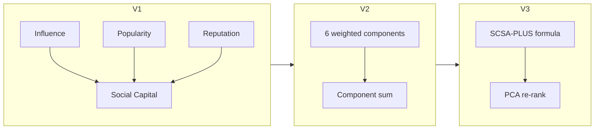

# Version comparison: V1, V2, and V3

Three implementations reproduce three published papers. Each builds on the previous version with the same dataset and base algorithms (`B1`, `CS`, `SC`, `SCSA`).

## At a glance

| | **V1** | **V2** | **V3** |
|---|--------|--------|--------|
| **Paper** | FedCSIS 2022 | AMCIS 2024 | SCSA-PLUS + PCA |
| **Focus** | Social Capital baseline | Multi-component SC | SCSA-PLUS + PCA re-ranking |
| **Config** | `configs/v1.yaml` | `configs/v2.yaml` | `configs/v3.yaml` |
| **Code** | `slices/v1/` | `slices/v2/` | `slices/v3/` |
| **Validation** | `paper_targets` | `reference_results.yaml` | `paper_targets` |

Validation criteria: [Evaluation](EVALUATION.md).

## Scoring evolution



### V1 — Social Capital baseline

| Code | Paper label | Scoring |
|------|-------------|---------|
| `B1` | B1 | Engagement counts |
| `CS` | CS-PLUS | TF-IDF cosine similarity |
| `SC` | SC | Influence + popularity + reputation |
| `SCSA` | SC+SA | SC + VADER sentiment |

Modules: `social_capital.py`, `recommenders.py`, `experiment.py`

### V2 — Enhanced components

Per base algorithm `BASE`:

| Variant | Description |
|---------|-------------|
| `{BASE}-STATE_ART` | Original trial order |
| `{BASE}-SCSA_PLUS` | Re-rank by V1 SC+SA score |
| `{BASE}-SCSA_PLUS_V3` | Re-rank by V2 weighted component score |

Default weights (0.20 each): sentiment, engagement, content relevance, network influence; 0.10 author influence and virality.

Modules: `components.py`, `features.py`, `recommenders.py`

> In V2, suffix `SCSA_PLUS_V3` means V2 component re-ranking. In V3, the same suffix means PCA re-ranking.

### V3 — SCSA-PLUS + PCA

```text
(author_strength + interactions + media + diversity + mentions + token_length + context) × recency
```

| Variant | Description |
|---------|-------------|
| `{BASE}-STATE_ART` | Original trial order |
| `{BASE}-SCSA_PLUS` | Re-rank by `scsa_plus_score` |
| `{BASE}-SCSA_PLUS_V3` | PCA first-component re-rank |
| `SCSA_PLUS` | Standalone per-user ranking |

Modules: `tweet_metrics.py`, `pca_ranking.py`, `recommenders.py`

## Pipeline dependency

```text
data/raw/ → V1 preprocess → V2 preprocess → V3 preprocess
         → V1 experiment  → V2 experiment  → V3 experiment
         → reports/v1/    → reports/v2/    → reports/v3/
```

`recsocial run all` executes the full chain with shared preprocessing.

## Which version to use

| Goal | Version |
|------|---------|
| Social Capital fundamentals | V1 |
| AMCIS enhanced-component paper | V2 |
| SCSA-PLUS + PCA paper | V3 |
| Compare all publications | `recsocial run all` + `recsocial validate` |
| Tune scoring | V2 or V3 configs — [Improving algorithms](IMPROVING.md) |

## Further reading

- [Tutorial](TUTORIAL.md) — data layer and custom algorithms
- [Architecture](ARCHITECTURE.md) — module map
- [V1 notes](v1/reproduction_notes.md) · [V2 notes](v2/reproduction_notes_v2.md) · [V3 notes](v3/reproduction_notes_v3.md)
