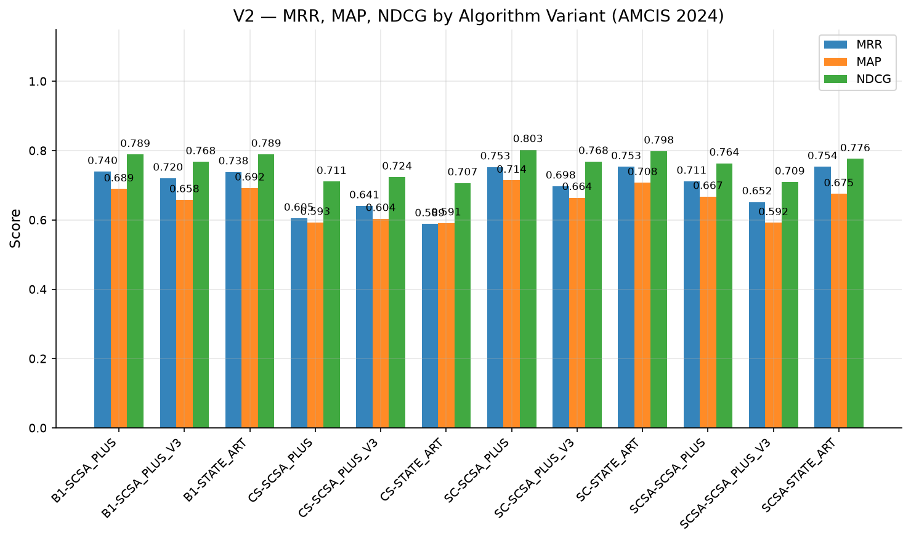
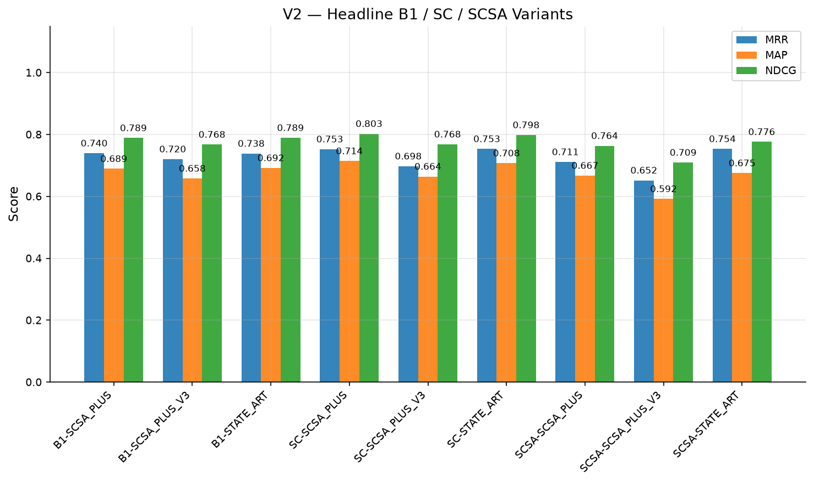
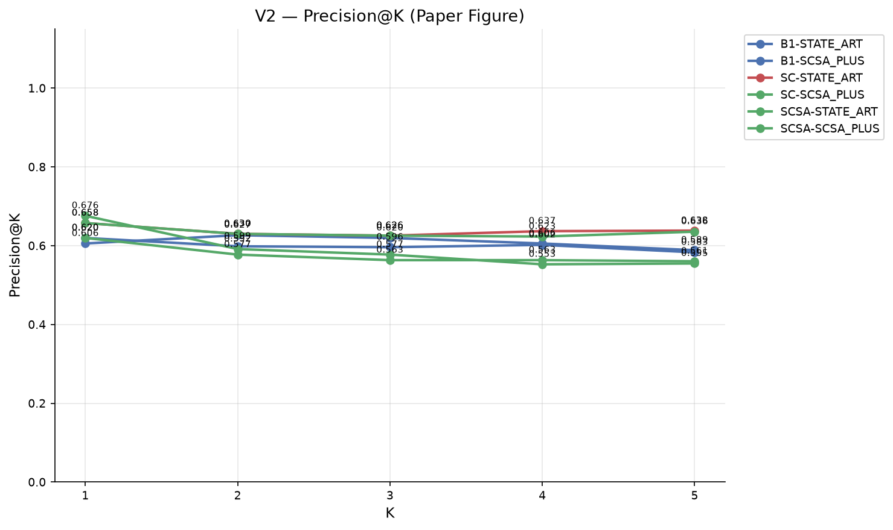
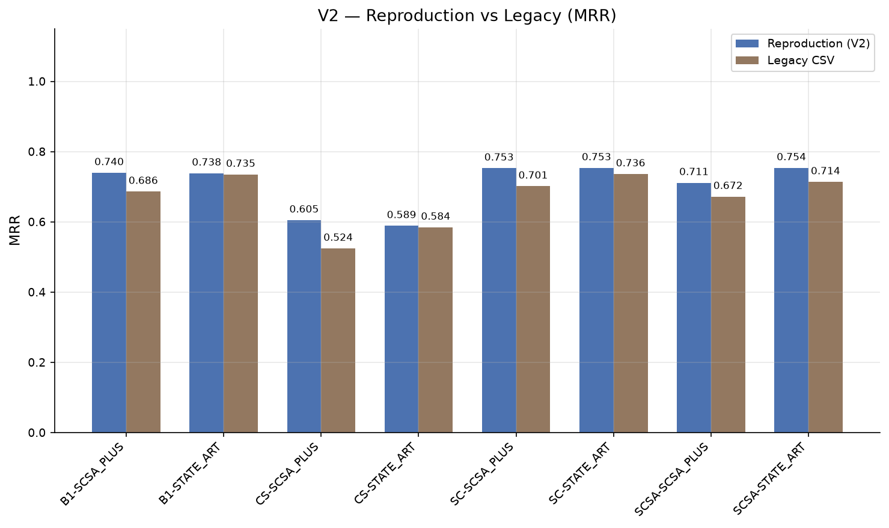
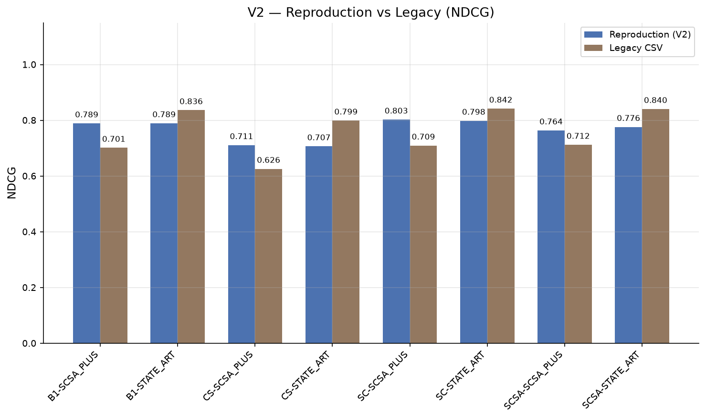
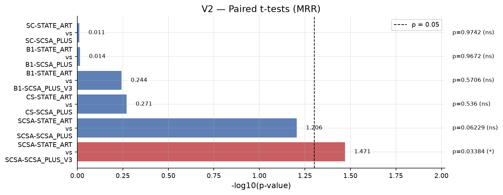
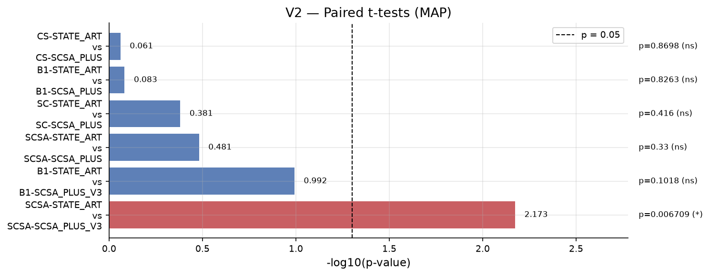
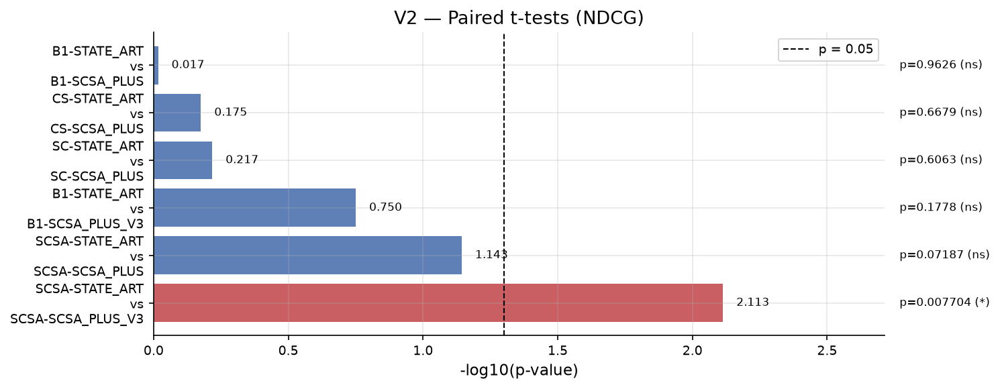

# Figure Gallery

Auto-generated charts for paper-style validation.

## All algorithm variants — MRR, MAP, NDCG

## Headline B1 / SC / SCSA families

## Precision@1–5 (paper requirement)

## Legacy validation — MRR

## Legacy validation — NDCG

## Paired t-tests — MRR

## Paired t-tests — MAP

## Paired t-tests — NDCG

